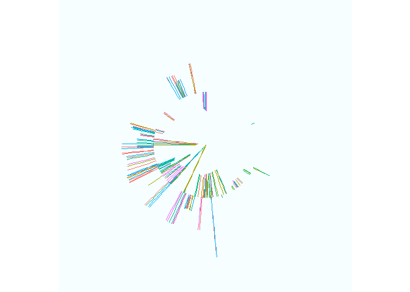

umart: umap art generator
================
Nelson Gonzabato
2022-02-22

# Installation

``` r
devtools::install_github("Nelson-Gon/umart")
```

# Load library

``` r
library(umart)
```

    ## Loading required package: ggplot2

# Data Generation

``` r
r_x <- generate_data(mean = 233, sd = 0.5)
r_y <- generate_data(mean = 520, sd = 0.05)
df <- data.frame(x = r_x, y=r_y, group = rep(paste0("grp_", 1:5), 10))
```

# Run UMAP

``` r
umap_df <- run_umap(df[, -3],neighbors = 20, seed = 520)
```

# Generate umart

``` r
generate_umart(umap_df, group_col = df$group)
```

<!-- -->

# Many neighbors

``` r
r_x <- generate_data(mean = 0.5, sd = 5)
r_y <- generate_data(mean = 0.6, sd = 50)
df <- data.frame(x = sin(r_x), y=r_y, group = rep(paste0("grp_", 1:5), 10))
neighbors <- 2:20
umaps <- lapply(neighbors, function(x) run_umap(df[, -3],neighbors = x,
                                                seed = 520))
umap_df <- do.call(rbind, umaps)
umap_df$neighbors <- neighbors 
groups <- rep(paste0("grp_", 1:5), 190)
generate_umart(umap_df, group_col = groups) +
  facet_wrap(~neighbors)
```

<!-- -->
